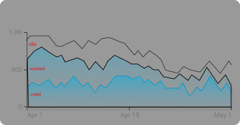

title: The Kubernetes Cost Optimization Guide

# The 4 Focus Areas

When starting out with Kubernetes Cost Optimization it's important to understand what to focus on. Redundant costs come from 2 main sources: ==wasted resources== and ==idle resources==. Both of these are usually caused by ==over-provisioning==, intentional or unintentional. On the other hand - thoughtless cost reduction activity can lead to ==under-provisioning==, which causes performance and reliability issues. 

When optimizing our cluster costs we want to focus on all of these areas iteratively - in order to keep our clusters as cost-effective and performant as needed.

Now let's explain each of these focus areas in more detail.

## Wasted Resources

==Wasted resources== are the resources that have been allocated but not utilized. 
In most unoptimizaed clusters we're observing up to 50% of waste, which translates to thousands of dollars or euros monthly.

This waste comes from over-provisioning the containers in our pods.
Read on to understand the reasons and perils of over-provsioning.

## Idle Resources

Kubernetes comes with a promise of automatic bin packing. I.e - it is supposed to fit the largest possible amount of pods on every node in the cluster. But this is again dependent on engineers correctly defining 1) resource requests and 2) node sizes. Even with smart and well-tuned autoscaling tools like Karpenter this doesn't always work and we find ourselves with nodes that are more than half empty - with resources that were neither requested nor utilized. All these are **idle resources** and taking care of reducing them is an important focus area of Kubernetes Cost Optimization.

## Overprovisioning

Pinpointing the exact memory and CPU requests for our pods is hard - it requires observing the application behaviour under production load over a significant time period. 
Therefore most engineers prefer to err towards ==overprovisioning==  - i.e setting requests much higher than the application will ever use.

This leads to a large amount of allocated but unutilized resources all across the cluster. Just imagine your cluster runs 200 pods and each of them requests 100Mb more memory than it actually uses. Altogether you'll have 20Gb of wasted RAM across the cluster. These resources will be provisioned, paid for, but never actually used.

## Underprovisioning

Container underprovisioning in Kubernetes occurs when the resources allocated to containers are insufficient to meet the demands of the applications they run. This scenario can arise from: 

- underestimating the resource needs of an application
- excessively aggressive optimization based on incomplete data 
- not setting resource requests altogether - which gives us BestEffort QoS pods

Underprovisioning can lead to several issues, including poor application performance, increased latency, and even outages as containers are killed on OOM or evicted because of resource exhaustion. This can be especially problematic in production environments where reliability and responsiveness are critical. 

Browse the rest of our guides to learm how to address each one of these focus areas in your Kubernetes cost optimization effort.